## 🔄 API and Database Interaction – Fetch User Data Flow

## This diagram shows how an API processes a user data request and interacts with the database.

```mermaid
sequenceDiagram
    participant Client as 🌐 Client (Frontend App)
    participant API as 🛠️ REST API (FastAPI / ASP.NET Core)
    participant ORM as 🧩 ORM (SQLAlchemy / Entity Framework)
    participant DB as 🗄️ Database (PostgreSQL / SQL Server)

    Client->>API: GET /users/123
    API->>ORM: Fetch user by ID (123)
    ORM->>DB: SELECT * FROM Users WHERE id = 123
    DB-->>ORM: Return user record
    ORM-->>API: User object
    API-->>Client: JSON response with user data
```



---

### 💡 Where This Is Useful:
- **Backend developers:** To visualize the full stack interaction for debugging or planning.
- **Full-stack teams:** Align frontend-backend data flow.
- **Documentation:** Embed this in README, wiki, or Confluence.

---

### 🔧 Real Example:
- In **FastAPI**:
  ```python
  @app.get("/users/{user_id}")
  def get_user(user_id: int, db: Session = Depends(get_db)):
      return db.query(User).filter(User.id == user_id).first()
  ```