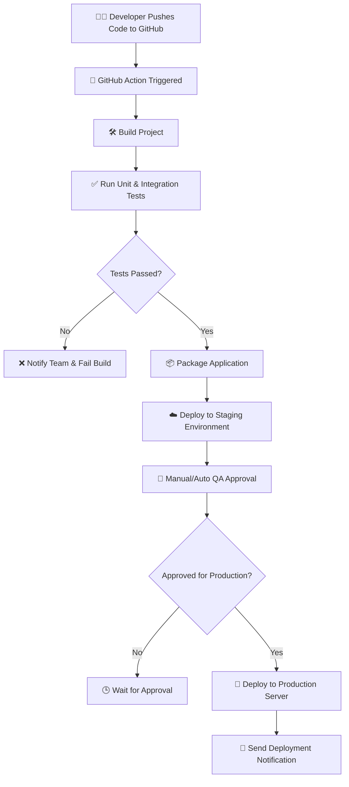

## 🚀 CI/CD Deployment Pipeline – GitHub to Production

## This diagram illustrates an end-to-end CI/CD workflow triggered by a developer's code push.

### 🧠 **Where This Is Used in Real Projects:**
- **Python Project:** Deploy a FastAPI app with Pytest + Docker to AWS or Azure using GitHub Actions.
- **.NET Project:** Build and deploy an ASP.NET Core app via Azure DevOps to an Azure App Service or Kubernetes cluster.

### 💡 Benefits:
- ✅ Clearly documents the CI/CD pipeline for DevOps engineers and developers.
- ✅ Easy to embed in project wikis (e.g., GitHub, Azure DevOps, Confluence).
- ✅ Simplifies troubleshooting by visualizing each step.
- ✅ Facilitates onboarding for new team members by providing a clear overview of the deployment process.
