## 🚀 CI/CD Deployment Pipeline – GitHub to Production

## This diagram illustrates an end-to-end CI/CD workflow triggered by a developer's code push.

```mermaid
flowchart TD
    A[👨‍💻 Developer Pushes Code to GitHub] --> B[🔁 GitHub Action Triggered]
    B --> C[🛠️ Build Project]
    C --> D[✅ Run Unit & Integration Tests]
    D --> E{Tests Passed?}
    E -- No --> F[❌ Notify Team & Fail Build]
    E -- Yes --> G[📦 Package Application]
    G --> H[☁️ Deploy to Staging Environment]
    H --> I[🔎 Manual/Auto QA Approval]
    I --> J{Approved for Production?}
    J -- No --> K[🕒 Wait for Approval]
    J -- Yes --> L[🚀 Deploy to Production Server]
    L --> M[📩 Send Deployment Notification]
```

### 🧠 **Where This Is Used in Real Projects:**
- **Python Project:** Deploy a FastAPI app with Pytest + Docker to AWS or Azure using GitHub Actions.
- **.NET Project:** Build and deploy an ASP.NET Core app via Azure DevOps to an Azure App Service or Kubernetes cluster.

### 💡 Benefits:
- ✅ Clearly documents the CI/CD pipeline for DevOps engineers and developers.
- ✅ Easy to embed in project wikis (e.g., GitHub, Azure DevOps, Confluence).
- ✅ Simplifies troubleshooting by visualizing each step.
- ✅ Facilitates onboarding for new team members by providing a clear overview of the deployment process.
