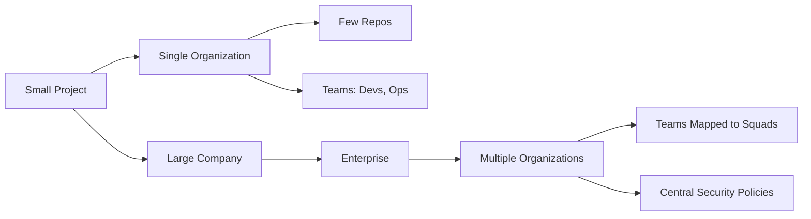
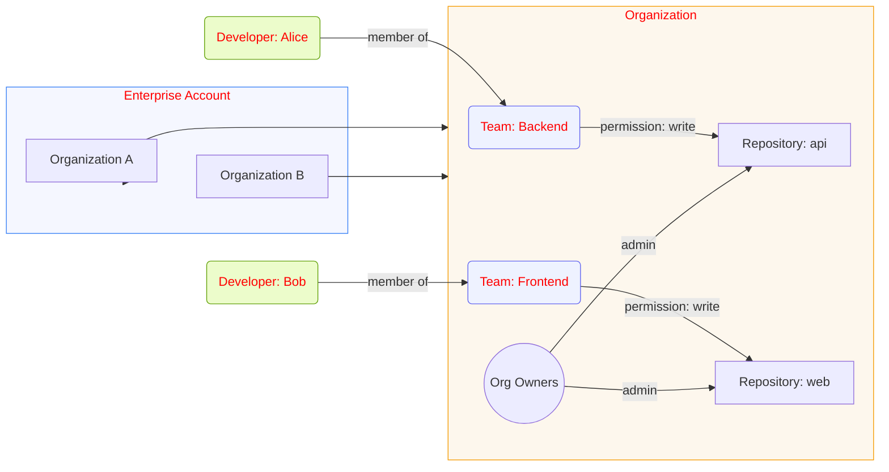

## Project Scale Comparison

**Small project:** single Organization with a few repos. Teams: devs, ops.

**Large company:** Enterprise with multiple Organizations (by department or legal entity). Each org has teams mapped to squads and central enterprise security policies applied.

## Enterprise Account Structure

