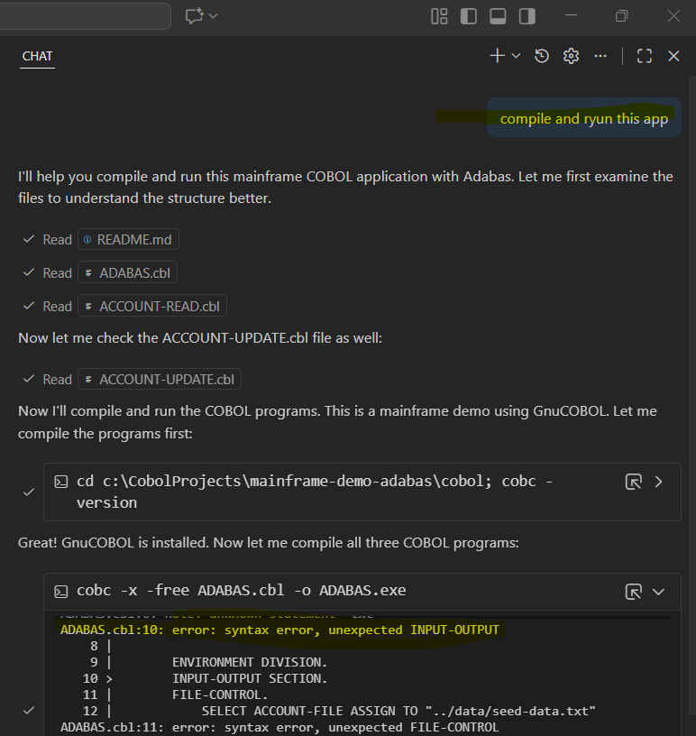
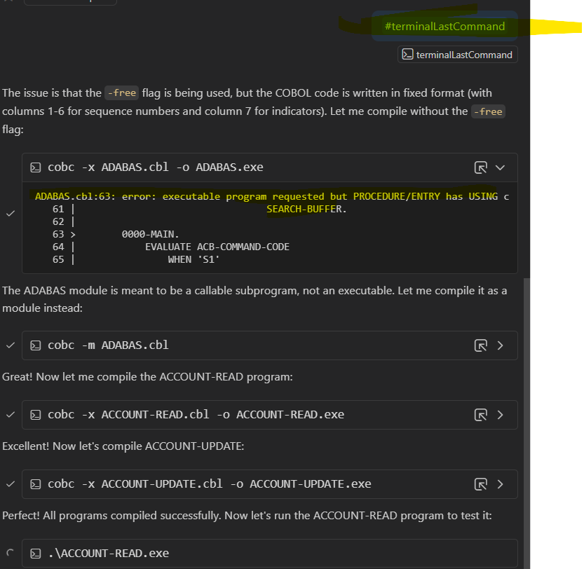
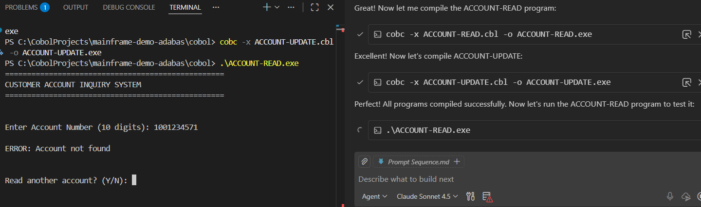
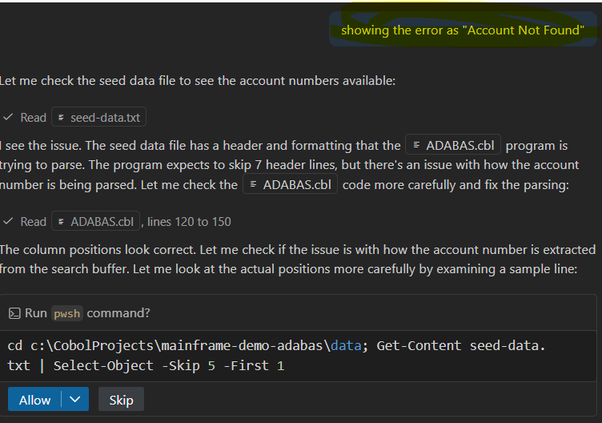
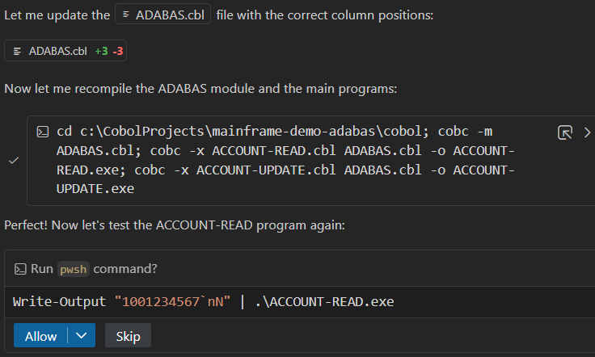
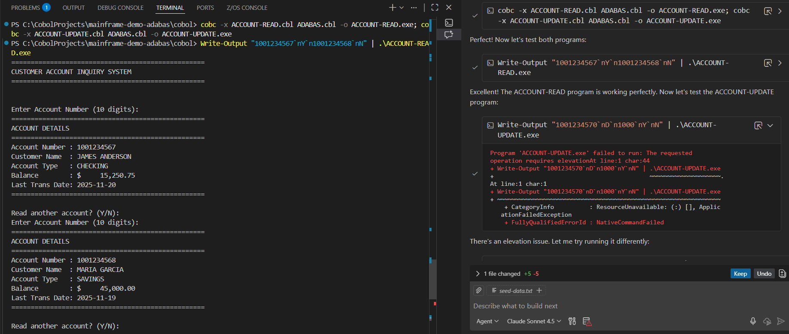

**Step 1**
- open chat window and enter your prompt as in below screenshot

**Step 2**

**Step 3**

**Step 4** copy and paste the error in chat window

**Step 4.1** review the suggestions and apply the changes and move to next error until all errors are resolved

Step 5: Once all errors are resolved, run the program to verify functionality

**Step 6**: Finally you will be able to fix the errors and run the program successfully

## Sequence Diagram

**Prompt**: "can you create a sequence diagram of the app showing the data flow of the app. Please create this in mermaid format so that I can render this in a markdown file."

```mermaid
sequenceDiagram
    participant User
    participant ACCOUNT-READ as ACCOUNT-READ.cbl
    participant ACCOUNT-UPDATE as ACCOUNT-UPDATE.cbl
    participant ADABAS as ADABAS.cbl (Mock)
    participant DataFile as seed-data.txt

    Note over User,DataFile: ACCOUNT-READ Flow (Read Account Information)
    
    User->>ACCOUNT-READ: Start Program
    ACCOUNT-READ->>User: Display Welcome Screen
    ACCOUNT-READ->>User: Prompt for Account Number
    User->>ACCOUNT-READ: Enter Account# (e.g., 1001234567)
    
    ACCOUNT-READ->>ACCOUNT-READ: Build Search Buffer<br/>(ACCOUNT-NUMBER,1,{number})
    ACCOUNT-READ->>ADABAS: CALL 'ADABAS' (S1 Command)<br/>+ ACB Control Block<br/>+ Format Buffer<br/>+ Search Buffer
    
    ADABAS->>DataFile: OPEN INPUT seed-data.txt
    DataFile-->>ADABAS: File Handle
    
    ADABAS->>DataFile: READ lines sequentially
    DataFile-->>ADABAS: Account Lines
    
    ADABAS->>ADABAS: Skip 7 header lines
    ADABAS->>ADABAS: Parse each line:<br/>- Extract Account Number (cols 1-10)<br/>- Compare with search number
    
    alt Account Found
        ADABAS->>ADABAS: Parse full record:<br/>- Name (cols 13-39)<br/>- Type (cols 41-55)<br/>- Balance (cols 57-70)<br/>- Date (cols 72-79)
        ADABAS->>ADABAS: Build Record Buffer
        ADABAS->>ADABAS: Set ACB-RESPONSE-CODE = 000<br/>Set ACB-ISN
        ADABAS-->>ACCOUNT-READ: Return Success + Record Data
        ACCOUNT-READ->>ACCOUNT-READ: Move Record Buffer to<br/>ACCOUNT-RECORD structure
        ACCOUNT-READ->>User: Display Account Details:<br/>- Account Number<br/>- Customer Name<br/>- Account Type<br/>- Formatted Balance<br/>- Formatted Date
    else Account Not Found
        ADABAS->>ADABAS: Set ACB-RESPONSE-CODE = 003
        ADABAS-->>ACCOUNT-READ: Return Error
        ACCOUNT-READ->>User: Display "Account not found"
    end
    
    ADABAS->>DataFile: CLOSE seed-data.txt
    
    ACCOUNT-READ->>User: Ask "Read another account? (Y/N)"
    User->>ACCOUNT-READ: Enter Choice
    
    alt Continue = Y
        Note over User,DataFile: Loop back to account input
    else Continue = N
        ACCOUNT-READ->>User: Display "Session Ended"
        ACCOUNT-READ->>User: Program Terminates
    end

    Note over User,DataFile: ACCOUNT-UPDATE Flow (Update Account Balance)
    
    User->>ACCOUNT-UPDATE: Start Program
    ACCOUNT-UPDATE->>User: Display Welcome Screen
    ACCOUNT-UPDATE->>ACCOUNT-UPDATE: Get Current Date (YYYYMMDD)
    ACCOUNT-UPDATE->>User: Prompt for Account Number
    User->>ACCOUNT-UPDATE: Enter Account# (e.g., 1001234570)
    
    ACCOUNT-UPDATE->>ACCOUNT-UPDATE: Build Search Buffer
    ACCOUNT-UPDATE->>ADABAS: CALL 'ADABAS' (S1 Command)<br/>Search for Account
    
    ADABAS->>DataFile: OPEN INPUT seed-data.txt
    ADABAS->>DataFile: READ and search for account
    
    alt Account Found
        ADABAS->>ADABAS: Parse record and build buffer
        ADABAS-->>ACCOUNT-UPDATE: Return Success + Record + ISN
        ACCOUNT-UPDATE->>ACCOUNT-UPDATE: Save Current Balance<br/>Save ISN for update
        ACCOUNT-UPDATE->>User: Display Current Account Info:<br/>- Number, Name, Type<br/>- Current Balance<br/>- Last Transaction Date
        
        ACCOUNT-UPDATE->>User: Display Transaction Menu:<br/>D - Deposit<br/>W - Withdrawal<br/>A - Balance Adjustment
        User->>ACCOUNT-UPDATE: Select Transaction Type
        ACCOUNT-UPDATE->>User: Prompt for Amount
        User->>ACCOUNT-UPDATE: Enter Amount
        
        ACCOUNT-UPDATE->>ACCOUNT-UPDATE: Calculate New Balance:<br/>- Deposit: Old + Amount<br/>- Withdrawal: Old - Amount<br/>  (Check insufficient funds)<br/>- Adjustment: Set to Amount
        
        alt Withdrawal > Balance
            ACCOUNT-UPDATE->>User: Display "Insufficient Funds" Error
        else Valid Transaction
            ACCOUNT-UPDATE->>User: Display New Balance<br/>Prompt "Confirm update? (Y/N)"
            User->>ACCOUNT-UPDATE: Enter Y/N
            
            alt Confirmed = Y
                ACCOUNT-UPDATE->>ACCOUNT-UPDATE: Build Update Buffer:<br/>- New Balance<br/>- Current Date
                ACCOUNT-UPDATE->>ADABAS: CALL 'ADABAS' (A1 Command)<br/>+ Update Format Buffer<br/>+ Update Buffer<br/>+ Saved ISN
                
                ADABAS->>ADABAS: Mock Update<br/>(Display "Update simulated")
                ADABAS->>ADABAS: Set ACB-RESPONSE-CODE = 000
                ADABAS-->>ACCOUNT-UPDATE: Return Success
                
                ACCOUNT-UPDATE->>User: Display Update Success:<br/>- Account Number<br/>- Customer Name<br/>- Old Balance<br/>- New Balance<br/>- Transaction Type<br/>- Update Date
            else Confirmed = N
                ACCOUNT-UPDATE->>User: Display "Update cancelled"
            end
        end
    else Account Not Found
        ADABAS-->>ACCOUNT-UPDATE: Return Error Code 003
        ACCOUNT-UPDATE->>User: Display "Account not found"
    end
    
    ADABAS->>DataFile: CLOSE seed-data.txt
    
    ACCOUNT-UPDATE->>User: Ask "Update another account? (Y/N)"
    User->>ACCOUNT-UPDATE: Enter Choice
    
    alt Continue = Y
        Note over User,DataFile: Loop back to account input
    else Continue = N
        ACCOUNT-UPDATE->>User: Display "Session Ended"
        ACCOUNT-UPDATE->>User: Program Terminates
    end
```

 

## Modernization

**Prompt**: "Generate some focused prompts for modernizing this COBOL app to Java.."

